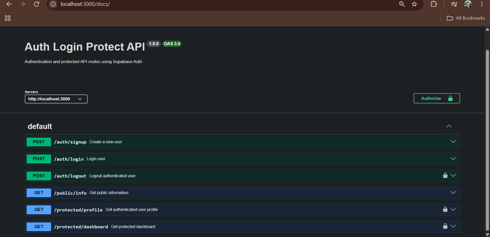

# Auth Login Protect API

A secure REST API built with **Node.js, Express.js, and Supabase Auth**.

The API provides user signup/login, JWT-based authentication, protected routes, logout, and interactive Swagger API documentation.

## Tech Stack

* Node.js
* Express.js
* Supabase Auth
* JWT
* Swagger UI
* OpenAPI 3.0

## Features

* User registration
* User login
* Supabase JWT authentication
* Reusable authentication middleware
* Protected profile endpoint
* Protected dashboard endpoint
* Authenticated logout
* Public API endpoint
* Swagger UI documentation
* Bearer token authorization

## Project Setup

### 1. Clone the repository

```bash
git clone YOUR_GITHUB_REPOSITORY_URL
cd auth-login-protect
```

### 2. Install dependencies

```bash
npm install
```

### 3. Configure environment variables

Create a `.env` file in the project root:

```env
SUPABASE_URL=your_supabase_project_url
SUPABASE_KEY=your_supabase_key
PORT=3000
```

Never commit the `.env` file or expose Supabase credentials publicly.

### 4. Start the server

```bash
node server.js
```

The API will run at:

```text
http://localhost:3000
```

## API Endpoints

| Method | Endpoint               | Authentication | Description                    |
| ------ | ---------------------- | -------------- | ------------------------------ |
| POST   | `/auth/signup`         | No             | Create a new user              |
| POST   | `/auth/login`          | No             | Login and receive access token |
| POST   | `/auth/logout`         | Bearer JWT     | Logout authenticated user      |
| GET    | `/public/info`         | No             | Public information             |
| GET    | `/protected/profile`   | Bearer JWT     | Get authenticated user profile |
| GET    | `/protected/dashboard` | Bearer JWT     | Access protected dashboard     |

## Authentication

After successful login, the API returns an `access_token`.

Use the token in protected requests:

```text
Authorization: Bearer <access_token>
```

Protected endpoints reject requests when the token is missing, invalid, or expired.

## Swagger Documentation 

### Swagger UI

 

Interactive API documentation is available at:

```text
http://localhost:3000/docs
```

Swagger UI supports Bearer JWT authorization for protected endpoints.

## Protected Routes

The following endpoints require authentication:

```text
GET /protected/profile
GET /protected/dashboard
POST /auth/logout
```

Authentication is handled through reusable Express middleware that extracts and verifies the Supabase access token.

## Security

Environment variables are stored locally in `.env`.

The `.env` file is excluded from Git using `.gitignore`.

No Supabase credentials should be committed to the repository.

## License

This project was created as part of an API authentication assignment.


